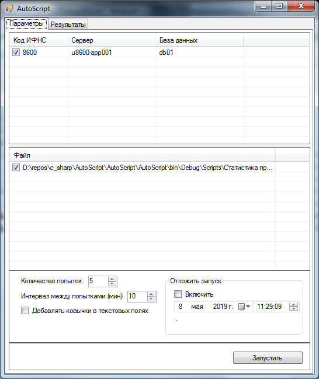
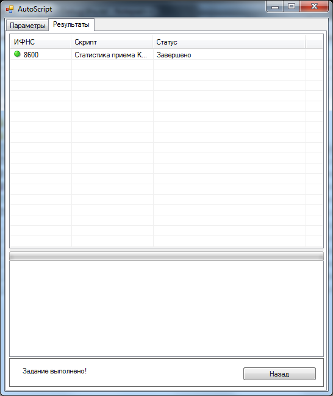

# AutoScript

## Описание
Автоматическое выполнение sql-скриптов на базах данных Microsoft SQL Server. Скрипты могут выполняться паралельно, на разных sql серверах и разных базах данных.

## Установка, настройка
* Пример настройки файла `Ifns.txt`:
```txt
# Код Инспекции|имя сервера или ip-адрес|имя базы данных
8601|192.168.101.5|Db01
```
* В папке `Scripts` должны быть размещены скрипты
* Результаты выполнения скриптов сохраняются в папку `output`

## Измнения
* 15.02.2018 - создание

## Нужно доработать


## Снимки экрана

